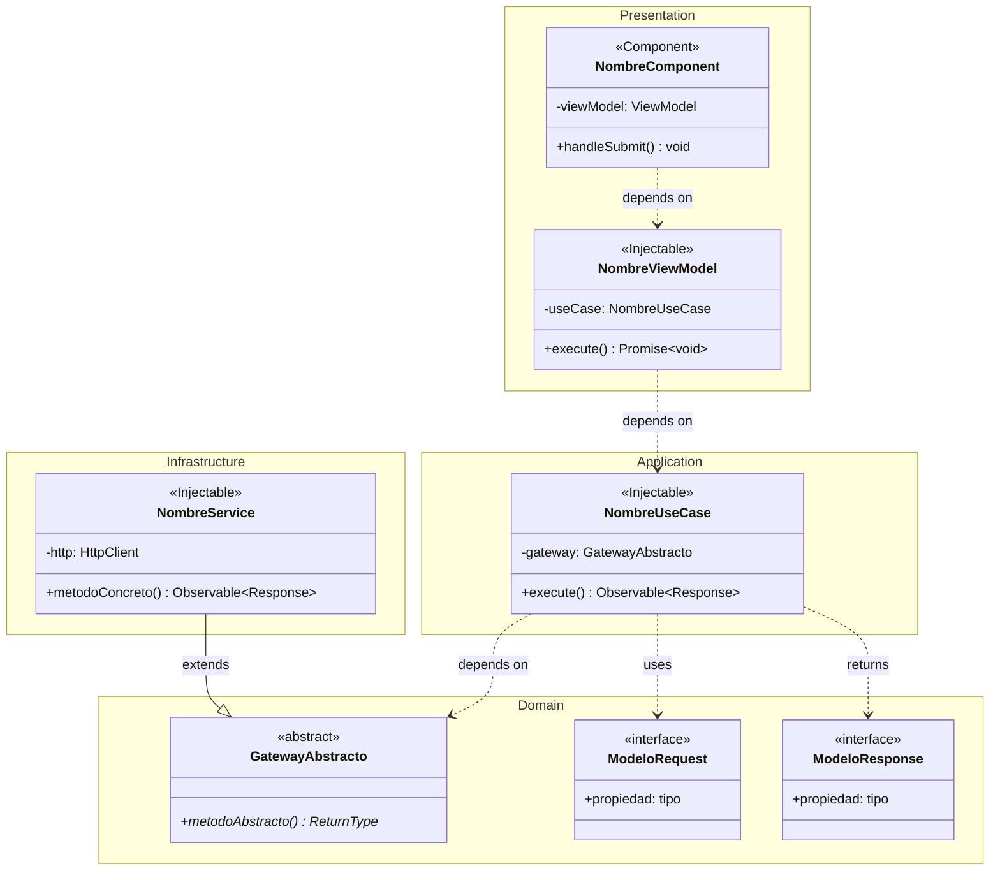

# Arquitectura Limpia (Clean Architecture) — Guía y Diagramas UML

Esta skill proporciona contexto completo sobre la Arquitectura Limpia implementada en proyectos Angular y guías para la creación de diagramas UML usando Mermaid y StarUML.

## Estructura General del Proyecto

Un proyecto Angular que sigue **Arquitectura Limpia (Clean Architecture)** se organiza en 4 capas principales dentro de `src/app/`:

```
<nombre-proyecto>/
└── src/app/
    ├── domain/           ← Capa de Dominio (núcleo)
    │   ├── models/       ← Entidades e interfaces de datos
    │   └── gateways/     ← Puertos abstractos (contratos)
    ├── application/       ← Capa de Aplicación (casos de uso)
    │   └── use-cases/    ← Orquestadores de lógica de negocio
    ├── infrastructure/    ← Capa de Infraestructura (adaptadores)
    │   ├── services/     ← Implementaciones HTTP concretas
    │   └── infrastructure.module.ts  ← (Opcional) Módulo DI de infraestructura
    └── presentation/      ← Capa de Presentación (UI)
        ├── pages/        ← Componentes de página (smart components)
        ├── components/   ← Componentes reutilizables (organisms, molecules)
        ├── view-models/  ← ViewModels compartidos
        ├── services/     ← Servicios de presentación (estado UI)
        ├── guards/       ← Guards de navegación
        ├── directives/   ← Directivas Angular
        ├── templates/    ← Templates compartidos
        └── providers.ts  ← Registro de inyección de dependencias
```

> **Nota:** Algunos proyectos pueden usar variaciones en los nombres de carpetas (ej. `aplication/` con una sola "p", `infraestructure/` con "s" en vez de "c"). Respetar siempre la convención existente del proyecto que se esté modificando.

---

## Las 4 Capas en Detalle

### 1. Domain (Dominio) — El Núcleo

La capa de dominio es el **corazón** de la arquitectura. No tiene dependencias externas. Contiene:

- **Models (Entidades/Interfaces):** Definen la estructura de datos del negocio. Son interfaces TypeScript puras sin decoradores Angular.
  ```typescript
  // domain/models/user.model.ts
  export interface User {
    id: string;
    name: string;
    email: string;
  }

  export interface CreateUserRequest {
    name: string;
    email: string;
    password: string;
  }

  export interface CreateUserResponse {
    data: User;
    message: string;
  }
  ```

- **Gateways (Puertos Abstractos):** Clases abstractas que definen contratos. No contienen implementación — son el punto de inversión de dependencia que permite que la capa de aplicación no dependa de la infraestructura.
  ```typescript
  // domain/gateways/user.gateway.ts
  export abstract class UserGateway {
    abstract createUser(req: CreateUserRequest): Observable<CreateUserResponse>;
    abstract getUserById(id: string): Observable<User>;
  }
  ```

**Reglas del dominio:**
- NUNCA importar desde `infrastructure` ni `presentation`
- Solo usa tipos TypeScript puros, `Observable` de RxJS, y nada de Angular (excepto si se necesita `Injectable` para DI en gateways)
- Los gateways son siempre `abstract class` (no interfaces) para poder usarlos como tokens de DI en Angular

### 2. Application (Aplicación) — Casos de Uso

Contiene los **Use Cases** que orquestan la lógica de negocio. Cada caso de uso es una clase `@Injectable()` con un método `execute()`.

```typescript
// application/use-cases/create-user/create-user.usecase.ts
@Injectable({ providedIn: 'root' })
export class CreateUserUseCase {
  constructor(private userGateway: UserGateway) {}

  execute(req: CreateUserRequest): Observable<CreateUserResponse> {
    return this.userGateway.createUser(req);
  }
}
```

**Reglas de aplicación:**
- Depende SOLO de la capa de dominio (gateways y models)
- NUNCA importar desde `infrastructure` ni `presentation`
- Cada UseCase tiene una sola responsabilidad (SRP)
- El método principal se llama `execute()`
- Se inyecta el Gateway abstracto, NO la implementación concreta

### 3. Infrastructure (Infraestructura) — Adaptadores

Implementa los contratos definidos en el dominio. Contiene los **Services** que extienden los Gateways abstractos con implementaciones HTTP concretas.

```typescript
// infrastructure/services/user/user.service.ts
@Injectable({ providedIn: 'root' })
export class UserService extends UserGateway {
  private http = inject(HttpClient);
  private readonly baseUrl = `${environment.API_BASE_URL}/users`;

  createUser(req: CreateUserRequest): Observable<CreateUserResponse> {
    return this.http.post<CreateUserResponse>(this.baseUrl, req).pipe(
      catchError(this.handleError.bind(this))
    );
  }

  getUserById(id: string): Observable<User> {
    return this.http.get<User>(`${this.baseUrl}/${id}`).pipe(
      catchError(this.handleError.bind(this))
    );
  }
}
```

> **Recomendación — Servicios separados por acción:** Si bien un solo servicio (ej. `UserService`) puede implementar todos los métodos del gateway, también es válido tener **un servicio por cada acción**: `CreateUserService`, `GetUserByIdService`, `DeleteUserService`, etc. Cada servicio implementaría su propio gateway específico y tendría su propio caso de uso asociado. Este enfoque favorece una mayor granularidad y cumple más estrictamente con el Principio de Responsabilidad Única (SRP). La elección depende del nivel de complejidad de cada operación y de las convenciones del equipo.

**Reglas de infraestructura:**
- Implementa (extiende) los Gateways abstractos del dominio
- Puede importar desde `domain` pero NUNCA desde `presentation`
- Usa `HttpClient` de Angular, `environment` para URLs, etc.
- Maneja errores HTTP, interceptors, headers, mappers

**Providers (Inyección de Dependencias):**

La conexión entre los gateways abstractos y sus implementaciones concretas se puede realizar de dos formas:

**Opción A — Archivo `providers.ts` en la capa de presentación:**
```typescript
// presentation/providers.ts
export const USER_PROVIDERS = [
  { provide: UserGateway, useClass: UserService },
  {
    provide: CreateUserUseCase,
    useFactory: (gw: UserGateway) => new CreateUserUseCase(gw),
    deps: [UserGateway],
  },
];
```

**Opción B (Recomendada) — Módulo `infrastructure.module.ts` en la capa de infraestructura:**

Se recomienda crear un módulo dedicado dentro de la capa de infraestructura que centralice el registro de la inyección de dependencias entre services y gateways. Este módulo se importa luego en el módulo principal de la capa de presentación.

```typescript
// infrastructure/infrastructure.module.ts
import { NgModule } from '@angular/core';
import { UserGateway } from '../domain/gateways/user.gateway';
import { UserService } from './services/user/user.service';

@NgModule({
  providers: [
    { provide: UserGateway, useClass: UserService },
  ],
})
export class InfrastructureModule {}
```

```typescript
// presentation/presentation.module.ts (o app.module.ts)
import { InfrastructureModule } from '../infrastructure/infrastructure.module';

@NgModule({
  imports: [InfrastructureModule],
  // ...
})
export class PresentationModule {}
```

> **Nota:** Ambas opciones son válidas. El `infrastructure.module.ts` ofrece mejor separación de responsabilidades ya que mantiene el registro de adaptadores dentro de la propia capa de infraestructura. El archivo `providers.ts` en presentación es más sencillo y aplica bien para proyectos con pocos servicios.

**Reglas de presentación:**
- Puede importar desde todas las capas
- Los componentes deben ser `standalone: true`
- Usar `inject()` en vez de inyección por constructor cuando sea posible
- Los ViewModels se proveen a nivel de componente en `providers: []`
- Las páginas son "smart components" que orquestan; los componentes hijos son "dumb/presentational"

---

## Flujo de Dependencias (Regla de Dependencia)

```
Presentation → Application → Domain ← Infrastructure
```

La flecha de dependencia siempre apunta **hacia el dominio**. La infraestructura depende del dominio (implementa sus contratos), NO al revés. Esto se logra con el principio de **Inversión de Dependencias (DIP)**.

---

## Guía para Diagramas UML

Cuando generes diagramas UML para este tipo de proyecto, sigue estas pautas.

### Tipos de Relaciones UML

Para diagramas de clases, utilizar correctamente estos tipos de relaciones:

| Relación | Descripción | Sintaxis Mermaid | Cuándo usarla |
|---|---|---|---|
| **Dependencia** | Uso temporal de otra clase (parámetro, variable local) | `A ..> B` (línea punteada con flecha abierta) | UseCase depende del Gateway; Component depende del ViewModel |
| **Asociación** | Referencia persistente a otra clase (propiedad de instancia) | `A --> B` (línea sólida con flecha abierta) | Component tiene referencia a un Service; ViewModel tiene referencia a UseCase |
| **Agregación** | "Tiene un" — el contenido puede existir sin el contenedor | `A o-- B` (rombo vacío) | Un Component agrega otros Components que se importan externamente |
| **Composición** | "Se compone de" — el contenido NO existe sin el contenedor | `A *-- B` (rombo lleno) | Un modelo Response se compone de sub-interfaces internas |
| **Herencia/Generalización** | Extends — clase hija extiende clase padre | `A <\|-- B` o `A --\|> B` (triángulo cerrado) | Service extends Gateway abstracto |
| **Implementación/Realización** | Implements — clase implementa interfaz | `A <\|.. B` o `A ..\|> B` (triángulo cerrado, línea punteada) | Service implementa Gateway abstracto |

### Relaciones Específicas de Clean Architecture en Angular

Usar estas convenciones para las relaciones entre capas:

- **Service → Gateway:** `Herencia` (`<|--`) porque el Service **extiende** el Gateway abstracto
- **UseCase → Gateway:** `Dependencia` (`..>`) porque el UseCase recibe el Gateway por inyección y lo usa
- **ViewModel → UseCase:** `Dependencia` (`..>`) porque el ViewModel invoca el UseCase
- **Component → ViewModel:** `Dependencia` (`..>`) porque el Component usa el ViewModel inyectado
- **Page Component → Child Component:** `Agregación` (`o--`) porque la Page contiene componentes hijos
- **Response Model → Sub-Interfaces:** `Composición` (`*--`) porque las sub-interfaces son parte integral
- **Request Model → Sub-Interfaces:** `Composición` (`*--`)
- **Component → Component (imports):** `Dependencia` (`..>`) para standalone imports

### Estructura de un Diagrama Mermaid con Capas

Usar `namespace` o `subgraph` (en flowcharts) para agrupar clases por capa:



### Estereotipos UML en el Proyecto

Usar estos estereotipos para identificar el tipo de cada clase:

| Estereotipo | Uso |
|---|---|
| `<<abstract>>` | Gateways del dominio |
| `<<interface>>` | Models/entidades del dominio |
| `<<Injectable>>` | UseCases, ViewModels, Services |
| `<<Component>>` | Componentes Angular |
| `<<Service>>` | Services de infraestructura (opcional, puede usarse `<<Injectable>>`) |

### Buenas Prácticas para Diagramas

1. **Agrupar por capas** — Siempre organizar las clases dentro de bloques `namespace` que representen Domain, Application, Infrastructure y Presentation
2. **No incluir TODAS las propiedades** — Seleccionar solo las más relevantes (2-5 propiedades y 1-3 métodos por clase)
3. **Usar visibilidad** — `+` público, `-` privado, `#` protegido
4. **Mostrar tipos de retorno** — Especialmente `Observable<T>`, `Promise<T>`, `void`, `signal<T>`
5. **Respetar la dirección de dependencia** — Las flechas van de la capa exterior hacia la interior (Presentation → Application → Domain ← Infrastructure)
6. **Incluir la relación de DI** — Mostrar cómo se conectan las abstracciones con las implementaciones

### StarUML — Consideraciones

Cuando generes diagramas para StarUML:
- StarUML soporta XMI (XML Metadata Interchange) para importar/exportar modelos
- Usa los mismos tipos de relaciones UML estándar descritos arriba
- Los estereotipos se colocan con `<<NombreEstereotipo>>` sobre el nombre de la clase
- En StarUML se pueden crear paquetes (packages) para representar las capas
- Los paquetes se anidan: `src.app.domain`, `src.app.application`, etc.
- Para relaciones, usar la paleta de herramientas: Association, Dependency, Generalization, Realization, Composition, Aggregation
- Asociar notas a las clases con restricciones como `{abstract}` para gateways

Para diagramas más detallados con referencia a archivos específicos, consultar [references/architecture-examples.md](references/architecture-examples.md).

---

## Ejemplo: Flujo de Gestión de Usuarios

Para ver un ejemplo completo de la arquitectura aplicada a un flujo de creación de usuarios:

```
Domain:
  ├── UserGateway (abstract) → define createUser(), getUserById()
  ├── CreateUserRequest (interface) → name, email, password
  └── CreateUserResponse (interface) → data: User, message

Application:
  └── CreateUserUseCase → execute() invoca gateway.createUser()

Infrastructure:
  └── UserService extends UserGateway → HTTP POST/GET al backend

Presentation:
  ├── UserListComponent (Page) → listado de usuarios
  ├── UserDetailComponent (Page) → detalle de un usuario
  ├── UserFormComponent → formulario de creación/edición
  ├── UserTableComponent → tabla reutilizable de usuarios
  ├── CreateUserViewModel → orquesta el UseCase de creación
  └── UserListViewModel → maneja el estado de la lista de usuarios
```
