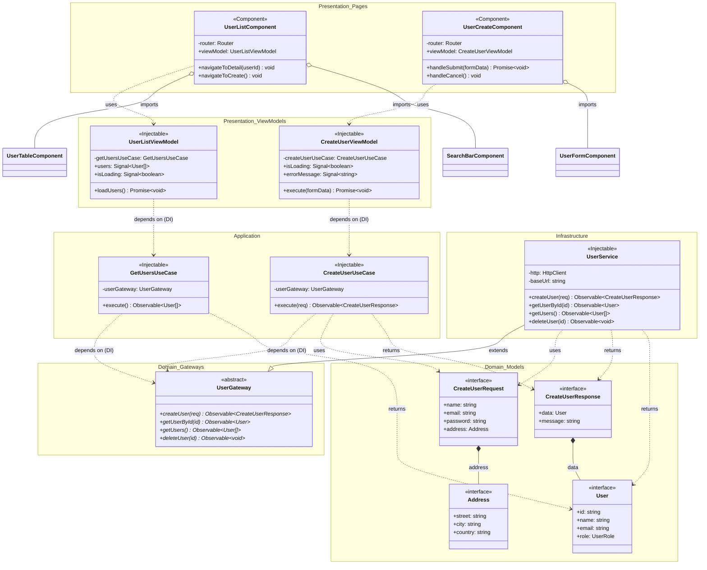

# Ejemplos Detallados de Arquitectura Limpia (Clean Architecture)

Este archivo contiene ejemplos genéricos para ilustrar los patrones de Arquitectura Limpia en proyectos Angular y cómo representarlos en diagramas UML.

## Tabla de Contenidos

1. [Ejemplo Completo: Gestión de Usuarios](#ejemplo-completo-gestión-de-usuarios)
2. [Enfoque Alternativo: Servicios Separados por Acción](#enfoque-alternativo-servicios-separados-por-acción)
3. [Patrones de Archivos por Capa](#patrones-de-archivos-por-capa)
4. [Diagrama Mermaid Completo del Flujo](#diagrama-mermaid-completo-del-flujo)
5. [Convenciones de Nombres](#convenciones-de-nombres)
6. [Patron Provider — Conexión DI](#patron-provider--conexión-di)
7. [Patrones de ViewModel](#patrones-de-viewmodel)
8. [Referencia Rápida de Relaciones UML en Mermaid](#referencia-rápida-de-relaciones-uml-en-mermaid)

---

## Ejemplo Completo: Gestión de Usuarios

### Capa Domain — Modelos

**`domain/models/user.model.ts`**

```typescript
export interface User {
  id: string;
  name: string;
  email: string;
  role: UserRole;
}

export enum UserRole {
  ADMIN = 'ADMIN',
  EDITOR = 'EDITOR',
  VIEWER = 'VIEWER',
}
```

**`domain/models/create-user-req.model.ts`**

```typescript
export interface Address {
  street: string;
  city: string;
  country: string;
}

export interface CreateUserRequest {
  name: string;
  email: string;
  password: string;
  address: Address;
}
```

**`domain/models/create-user-res.model.ts`**

```typescript
export interface CreateUserResponse {
  data: User;
  message: string;
  timestamp: string;
}
```

### Capa Domain — Gateway

**`domain/gateways/user.gateway.ts`**

```typescript
export abstract class UserGateway {
  abstract createUser(req: CreateUserRequest): Observable<CreateUserResponse>;
  abstract getUserById(id: string): Observable<User>;
  abstract getUsers(): Observable<User[]>;
  abstract deleteUser(id: string): Observable<void>;
}
```

### Capa Application — UseCase

**`application/use-cases/create-user/create-user.usecase.ts`**

```typescript
@Injectable({ providedIn: 'root' })
export class CreateUserUseCase {
  constructor(private userGateway: UserGateway) {}

  execute(req: CreateUserRequest): Observable<CreateUserResponse> {
    return this.userGateway.createUser(req);
  }
}
```

**`application/use-cases/get-users/get-users.usecase.ts`**

```typescript
@Injectable({ providedIn: 'root' })
export class GetUsersUseCase {
  constructor(private userGateway: UserGateway) {}

  execute(): Observable<User[]> {
    return this.userGateway.getUsers();
  }
}
```

### Capa Infrastructure — Service

**`infrastructure/services/user/user.service.ts`**

```typescript
@Injectable({ providedIn: 'root' })
export class UserService extends UserGateway {
  private http = inject(HttpClient);
  private readonly baseUrl = `${environment.API_BASE_URL}/users`;

  createUser(req: CreateUserRequest): Observable<CreateUserResponse> {
    return this.http.post<CreateUserResponse>(this.baseUrl, req).pipe(
      catchError(this.handleError.bind(this))
    );
  }

  getUserById(id: string): Observable<User> {
    return this.http.get<User>(`${this.baseUrl}/${id}`).pipe(
      catchError(this.handleError.bind(this))
    );
  }

  getUsers(): Observable<User[]> {
    return this.http.get<User[]>(this.baseUrl).pipe(
      catchError(this.handleError.bind(this))
    );
  }

  deleteUser(id: string): Observable<void> {
    return this.http.delete<void>(`${this.baseUrl}/${id}`).pipe(
      catchError(this.handleError.bind(this))
    );
  }

  private handleError(error: HttpErrorResponse): Observable<never> {
    console.error('UserService error:', error);
    return throwError(() => error);
  }
}
```

---

## Enfoque Alternativo: Servicios Separados por Acción

Como recomendación, en lugar de tener un único servicio (ej. `UserService`) que implemente todos los métodos del gateway, es posible crear **un servicio individual para cada acción**. Cada servicio extiende su propio gateway específico y tiene su propio caso de uso asociado.

Este enfoque aplica más estrictamente el **Principio de Responsabilidad Única (SRP)** y facilita el testing unitario al tener clases más pequeñas y enfocadas.

### Ejemplo con Servicios Separados

**Gateways separados:**
```typescript
// domain/gateways/create-user.gateway.ts
export abstract class CreateUserGateway {
  abstract execute(req: CreateUserRequest): Observable<CreateUserResponse>;
}

// domain/gateways/get-users.gateway.ts
export abstract class GetUsersGateway {
  abstract execute(): Observable<User[]>;
}

// domain/gateways/delete-user.gateway.ts
export abstract class DeleteUserGateway {
  abstract execute(id: string): Observable<void>;
}
```

**Servicios separados:**
```typescript
// infrastructure/services/create-user/create-user.service.ts
@Injectable({ providedIn: 'root' })
export class CreateUserService extends CreateUserGateway {
  private http = inject(HttpClient);
  private readonly baseUrl = `${environment.API_BASE_URL}/users`;

  execute(req: CreateUserRequest): Observable<CreateUserResponse> {
    return this.http.post<CreateUserResponse>(this.baseUrl, req).pipe(
      catchError(this.handleError.bind(this))
    );
  }
}

// infrastructure/services/get-users/get-users.service.ts
@Injectable({ providedIn: 'root' })
export class GetUsersService extends GetUsersGateway {
  private http = inject(HttpClient);
  private readonly baseUrl = `${environment.API_BASE_URL}/users`;

  execute(): Observable<User[]> {
    return this.http.get<User[]>(this.baseUrl).pipe(
      catchError(this.handleError.bind(this))
    );
  }
}
```

**Casos de uso correspondientes:**
```typescript
// application/use-cases/create-user/create-user.usecase.ts
@Injectable({ providedIn: 'root' })
export class CreateUserUseCase {
  constructor(private createUserGateway: CreateUserGateway) {}

  execute(req: CreateUserRequest): Observable<CreateUserResponse> {
    return this.createUserGateway.execute(req);
  }
}

// application/use-cases/get-users/get-users.usecase.ts
@Injectable({ providedIn: 'root' })
export class GetUsersUseCase {
  constructor(private getUsersGateway: GetUsersGateway) {}

  execute(): Observable<User[]> {
    return this.getUsersGateway.execute();
  }
}
```

**Registro DI con servicios separados:**
```typescript
// infrastructure/infrastructure.module.ts
@NgModule({
  providers: [
    { provide: CreateUserGateway, useClass: CreateUserService },
    { provide: GetUsersGateway, useClass: GetUsersService },
    { provide: DeleteUserGateway, useClass: DeleteUserService },
  ],
})
export class InfrastructureModule {}
```

> **¿Cuándo usar cada enfoque?**
> - **Servicio único** (`UserService`): Cuando las operaciones son simples y comparten configuración (base URL, headers, manejo de errores).
> - **Servicios separados** (`CreateUserService`, `GetUsersService`, etc.): Cuando cada operación tiene complejidad propia, headers distintos, lógica de retry diferente, o cuando se quiere máxima granularidad y testabilidad.

### Capa Presentation — Pages, Components y ViewModels

**Page: `presentation/pages/user-list/user-list.component.ts`**

```typescript
@Component({
  standalone: true,
  imports: [UserTableComponent, SearchBarComponent],
  providers: [UserListViewModel],
})
export class UserListComponent {
  private router = inject(Router);
  public viewModel = inject(UserListViewModel);

  public navigateToDetail(userId: string): void {
    this.router.navigate(['/users', userId]);
  }

  public navigateToCreate(): void {
    this.router.navigate(['/users', 'new']);
  }
}
```

**Page: `presentation/pages/user-create/user-create.component.ts`**

```typescript
@Component({
  standalone: true,
  imports: [UserFormComponent, PageLayoutComponent],
  providers: [CreateUserViewModel],
})
export class UserCreateComponent {
  private router = inject(Router);
  public viewModel = inject(CreateUserViewModel);

  public async handleSubmit(formData: CreateUserRequest): Promise<void> {
    await this.viewModel.execute(formData);
    this.router.navigate(['/users']);
  }

  public handleCancel(): void {
    this.router.navigate(['/users']);
  }
}
```

**ViewModel: `presentation/view-models/create-user/create-user.view-model.ts`**

```typescript
@Injectable()
export class CreateUserViewModel {
  private readonly createUserUseCase = inject(CreateUserUseCase);
  public readonly isLoading = signal<boolean>(false);
  public readonly errorMessage = signal<string>('');

  public async execute(formData: CreateUserRequest): Promise<void> {
    this.isLoading.set(true);
    this.errorMessage.set('');
    try {
      await lastValueFrom(this.createUserUseCase.execute(formData));
    } catch (error) {
      this.errorMessage.set('Error al crear el usuario. Intente nuevamente.');
    } finally {
      this.isLoading.set(false);
    }
  }
}
```

**ViewModel: `presentation/view-models/user-list/user-list.view-model.ts`**

```typescript
@Injectable()
export class UserListViewModel {
  private readonly getUsersUseCase = inject(GetUsersUseCase);
  public readonly users = signal<User[]>([]);
  public readonly isLoading = signal<boolean>(false);

  public async loadUsers(): Promise<void> {
    this.isLoading.set(true);
    try {
      const result = await lastValueFrom(this.getUsersUseCase.execute());
      this.users.set(result);
    } finally {
      this.isLoading.set(false);
    }
  }
}
```

---

## Patrones de Archivos por Capa

| Capa                     | Patrón de Nombre                                 | Ejemplo                       |
| ------------------------ | ------------------------------------------------- | ----------------------------- |
| Domain - Model           | `<nombre>.model.ts` / `<nombre>-req.model.ts`    | `user.model.ts`               |
| Domain - Gateway         | `<nombre>.gateway.ts`                             | `user.gateway.ts`             |
| Application - UseCase    | `<nombre>.usecase.ts`                             | `create-user.usecase.ts`      |
| Infrastructure - Service | `<nombre>.service.ts`                             | `user.service.ts`             |
| Presentation - Page      | `<nombre>.component.ts`                           | `user-list.component.ts`      |
| Presentation - ViewModel | `<nombre>.view-model.ts`                          | `create-user.view-model.ts`   |

---

## Diagrama Mermaid Completo del Flujo

Este es el diagrama completo del flujo de gestión de usuarios (listado y creación):



---

## Convenciones de Nombres

| Elemento       | Convención                       | Ejemplo                    |
| -------------- | --------------------------------- | -------------------------- |
| Gateway        | `<Nombre>Gateway`                 | `UserGateway`              |
| UseCase        | `<Acción><Entidad>UseCase`        | `CreateUserUseCase`        |
| Service        | `<Nombre>Service`                 | `UserService`              |
| ViewModel      | `<Acción><Entidad>ViewModel`      | `CreateUserViewModel`      |
| Page Component | `<Nombre>Component`               | `UserListComponent`        |
| Request Model  | `<Nombre>Request`                 | `CreateUserRequest`        |
| Response Model | `<Nombre>Response`                | `CreateUserResponse`       |

---

## Patron Provider — Conexión DI

El registro de la **inversión de dependencias** (conectar tokens abstractos con implementaciones concretas) se puede realizar de dos formas:

### Opción A — Archivo `providers.ts` en la capa de presentación

```typescript
// presentation/providers.ts
// Paso 1: Conectar Gateway abstracto con Service concreto
{ provide: UserGateway, useClass: UserService }

// Paso 2: Crear UseCase inyectando el Gateway
{
  provide: CreateUserUseCase,
  useFactory: (gw: UserGateway) => new CreateUserUseCase(gw),
  deps: [UserGateway],
}
```

### Opción B (Recomendada) — Módulo `infrastructure.module.ts`

Centralizar el registro de DI dentro de la capa de infraestructura usando un módulo Angular dedicado. Este módulo se importa luego desde la capa de presentación.

```typescript
// infrastructure/infrastructure.module.ts
import { NgModule } from '@angular/core';
import { UserGateway } from '../domain/gateways/user.gateway';
import { UserService } from './services/user/user.service';

@NgModule({
  providers: [
    { provide: UserGateway, useClass: UserService },
  ],
})
export class InfrastructureModule {}
```

```typescript
// presentation/presentation.module.ts (o app.module.ts)
import { InfrastructureModule } from '../infrastructure/infrastructure.module';

@NgModule({
  imports: [InfrastructureModule],
})
export class PresentationModule {}
```

> **Ventaja:** El `infrastructure.module.ts` mantiene el conocimiento de las implementaciones concretas dentro de la propia capa de infraestructura, evitando que la capa de presentación tenga que importar directamente los servicios concretos.

En un diagrama UML, esta relación se puede representar con una nota o con una dependencia desde el módulo de infraestructura hacia ambos (Gateway y Service).

---

## Patrones de ViewModel

Existen dos patrones principales de ViewModel:

### 1. ViewModel a nivel de componente (scope local)

Se proveen en el array `providers` del componente. Se destruyen con el componente.

```typescript
@Component({
  providers: [CreateUserViewModel, UserFormViewModel],
})
export class UserCreateComponent { ... }
```

### 2. ViewModel a nivel root (scope global/singleton)

Se proveen con `providedIn: 'root'`. Son singletons que persisten durante toda la sesión.

```typescript
@Injectable({ providedIn: 'root' })
export class AuthStateViewModel {
  public readonly isAuthenticated = signal<boolean>(false);
  public readonly currentUser = signal<User | null>(null);
}
```

---

## Referencia Rápida de Relaciones UML en Mermaid

```
Asociación:        A --> B        (línea sólida, flecha abierta)
Dependencia:       A ..> B        (línea punteada, flecha abierta)
Herencia:          A --|> B       (línea sólida, triángulo cerrado)
Realización:       A ..|> B       (línea punteada, triángulo cerrado)
Composición:       A *-- B        (línea sólida, rombo lleno)
Agregación:        A o-- B        (línea sólida, rombo vacío)
```

### Cuándo usar cada relación

| Relación en el código                              | Tipo UML                  | Mermaid   |
| ---------------------------------------------------- | ------------------------- | --------- |
| `class A extends B`                                  | Herencia                  | `A --|> B` |
| `class A implements B`                               | Realización              | `A ..|> B` |
| `inject(ServiceX)` como propiedad privada            | Asociación o Dependencia | `A ..> B` |
| Interface que contiene otra interface como propiedad | Composición              | `A *-- B` |
| Component que importa otro Component en `imports[]`  | Agregación               | `A o-- B` |
| Parámetro en un método                             | Dependencia               | `A ..> B` |
| `Observable<ModelX>` como tipo de retorno            | Dependencia               | `A ..> B` |
